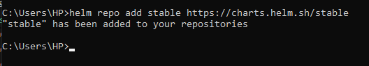
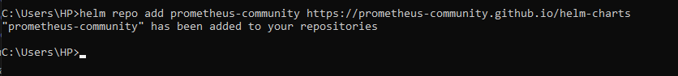
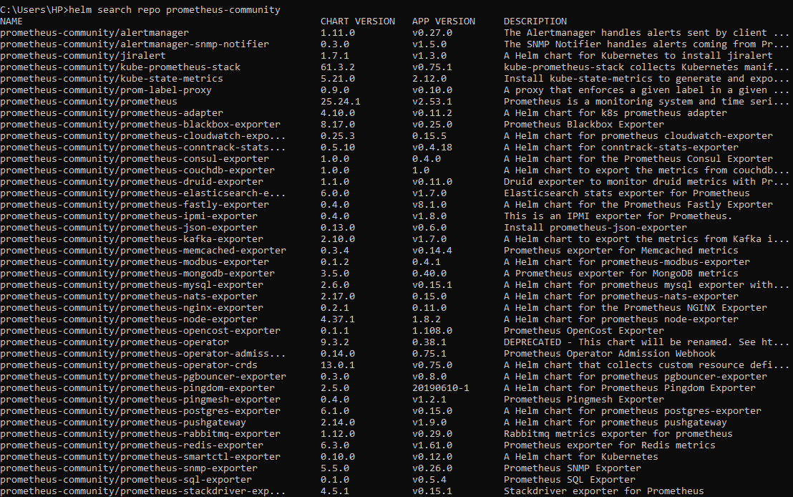

# EKS Monitoring 

### check this before you start :
https://www.coachdevops.com/2022/05/how-to-setup-monitoring-on-kubernetes.html


1. add the Helm Stable Chart
```powershell
helm repo add stable https://charts.helm.sh/stable
```



2. Add prometheus Helm repo
```powershell  
helm repo add prometheus-community https://prometheus-community.github.io/helm-charts
```


to check :
```powershell
helm search repo prometheus-community
```



3. Create Prometheus namespace

```powershell
kubectl create namespace prometheus
```
4. Install kube-prometheus-stack

> Below is helm command to install kube-prometheus-stack. The helm repo kube-stack-prometheus (formerly prometheus-operator) comes with a grafana deployment embedded

```powershell
helm install stable prometheus-community/kube-prometheus-stack -n prometheus
```

check if prometheus and grafana pods are running already:

```powershell
kubectl get pods -n prometheus
kubectl get svc -n prometheus
```

5. Edit Prometheus Service to use LoadBalancer
```powershell-interactive
kubectl edit svc stable-kube-prometheus-sta-prometheus -n prometheus
```
>:$ change type to "LoadBalancer" :wq!

6. Edit Grafana Service to use LoadBalancer
```powershell-interactive
kubectl edit svc stable-grafana -n prometheus
```
>:$ change type to "LoadBalancer" :wq!


```powershell
kubectl get svc -n prometheus
```

#
### Grafana

##### Create Kubernetes Cluster Monitoring Dashboard -1-

>12740

##### Create Kubernetes Cluster Monitoring Dashboard -2-

> 3119 

##### Create POD Monitoring Dashboard :
> 6417 


check to avoid conflicts 
```powershell
kubectl get svc -n prometheus
kubectl get svc -n calico-monitoring
```