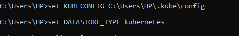

# Kubernetes

## 1. Install calico on EKS cluster :

> ⚠
> make sure to apply the first 8 terraform files without 10-nodegroup.tf file becuase 
> we want empty eks cluster 

#### troubleshoot
```powershell
kubectl get svc
aws eks --region eu-central-1 update-kubeconfig --name my_eks_cluster --profile default 
```
    
    
**for setting up the calico CNI 
follow these steps**

### ➡**steps:**
1. delete the aws-node daemon set to disable AWS VPC networking for pods
    ```powershell
    kubectl delete daemonset -n kube-system aws-node
    ```


2. Install the operator
    ```powershell
    kubectl create -f https://raw.githubusercontent.com/projectcalico/calico/v3.28.0/manifests/tigera-operator.yaml
    ```

3. Configure the Calico installation:
    ```powershell-interactive
    kind: Installation
    apiVersion: operator.tigera.io/v1
    metadata:
    name: default
    spec:
    kubernetesProvider: EKS
    cni:
        type: Calico
    calicoNetwork:
        bgp: Disabled
    ```
    ```powershell-interactive
    kubectl apply -f 1-calico-installation.yaml
    ```
    

4. Add node-group
    ```powershell
    terraform apply 
    ```
5. Check installation
    ```powershell
    kubectl get pod -n tigera-operator
    ```

6. Verify cluster
    ```powershell
    aws eks --region eu-central-1 update-kubeconfig --name my_eks_cluster --profile default
    ```


## 2. Install calicoctl to manage calico resources :

### ➡**steps:**
1. download calicoctl binary 
    ```powershell
    Invoke-WebRequest -Uri "https://github.com/projectcalico/calico/releases/download/v3.28.0/calicoctl-windows-amd64.exe" -OutFile "calicoctl.exe"
    ``` 
2. verify the plugin works
    ```powershell
    kubectl calico version
    ```
    **output:**

    
    
## 3. Enable kubectl to manage Calico APIs
### ➡**steps:**
1. Create an instance of an operator.tigera.io/APIServer with the following contents.
    ```yml
    apiVersion: operator.tigera.io/v1
    kind: APIServer
    metadata:
      name: default
    spec: {}
    ```
    ```powershell-interactive
    kubectl apply -f 11-api-server.yaml
    ```
    output : 

    

2. Confirm it appears as Available with the following command.
    ```powershell
    kubectl get tigerastatus apiserver
    ```

    check whether the APIs are available with the following command:
    ```powershell
    kubectl api-resources | grep '\sprojectcalico.org'
    ```

    output:

    

3. Use kubectl for projectcalico.org APIs
    ```powershell
    kubectl get ippools    
    ```
    output:

    
## 4. Configure calicoctl to connect to the Kubernetes API datastore

>configure the calicoctl CLI tool for your Kubernetes cluster

### ➡**steps:**

```powershell
set DATASTORE_TYPE=kubernetes
set KUBECONFIG=C:\Users\HP\.kube\config
calicoctl get nodes
```


  

<!-- 1. create configuration file 
    ```yaml
    apiVersion: projectcalico.org/v3
    kind: CalicoAPIConfig
    metadata:
    spec:
      datastoreType: 'kubernetes'
      kubeconfig: '/path/to/.kube/config'
    ```
    ### **check this:** ###
    #### [calicoctl.cfg](./configuration/calicoctl.cfg) 
    ####        

2. apply the configuration file 
    ```powershell
    calicoctl --config C:\path\to\your\calicoctl.cfg get nodes
    #calicoctl --config C:\Users\HP\Documents\usal\spring 24\fyp\vpc\configuration\calicoctl.cfg get nodes
    ``` -->
## 5. Monitor Calico component metrics   

>Use Prometheus configured for Calico components to get valuable metrics about the health of Calico.

**Overview:**
- Configure Calico to enable the metrics reporting.
- Create the namespace and service account that Prometheus will need.
- Deploy and configure Prometheus.
- View the metrics in the Prometheus dashboard and create a simple graph.
### ➡**steps:**

1. Configure Calico to enable metrics reporting (enable felix metrics)
    ```powershell
    kubectl patch felixconfiguration default --type merge --patch '{\"spec\":{\"prometheusMetricsEnabled\": true}}'
    ```
    output: felixconfiguration.projectcalico.org/default patched

    - Creating a service to expose Felix metrics
    ```powershell
    apiVersion: v1
    kind: Service
    metadata:
      name: felix-metrics-svc
      namespace: calico-system
    spec:
      clusterIP: None
      selector:
        k8s-app: calico-node
      ports:
      - port: 9091
        targetPort: 9091
    ```
    ```powershell-interactive
    kubectl apply -f 2-felix-metrics-service.yaml
    ```
    
    - Typha Configuration
    ```powershell
    kubectl patch installation default --type=merge -p '{\"spec\": {\"typhaMetricsPort\":9093}}'
    ```
    output: installation.operator.tigera.io/default patched

    - Creating a service to expose Typha metrics
    ```powershell
    apiVersion: v1
    kind: Service
    metadata:
      name: typha-metrics-svc
      namespace: calico-system
    spec:
      clusterIP: None
      selector:
        k8s-app: calico-typha
      ports:
      - port: 9093
        targetPort: 9093
    ```
    ```powershell-interactive
    kubectl apply -f 3-typha-metrics-service.yaml
    ```
    - kube-controllers configuration
    (verify):
    ```powershell
    kubectl get svc -n calico-system
    ```
    output: calico-kube-controllers-metrics   ClusterIP   10.43.77.57  <'none'>        9094/TCP   39d

2. Cluster preparation
    - namespace creation
    ```powershell
    apiVersion: v1
    kind: Namespace
    metadata:
      name: calico-monitoring
      labels:
        app:  ns-calico-monitoring
        role: monitoring
    ```
    ```powershell-interactive
    kubectl apply -f 4-calico-namespace.yaml
    ```    
    - Service account creation
    ```powershell
    apiVersion: rbac.authorization.k8s.io/v1
    kind: ClusterRole
    metadata:
      name: calico-prometheus-user
    rules:
    - apiGroups: [""]
      resources:
      - endpoints
      - services
      - pods
      verbs: ["get", "list", "watch"]
    - nonResourceURLs: ["/metrics"]
      verbs: ["get"]
    ---
    apiVersion: v1
    kind: ServiceAccount
    metadata:
      name: calico-prometheus-user
      namespace: calico-monitoring
    ---
    apiVersion: rbac.authorization.k8s.io/v1
    kind: ClusterRoleBinding
    metadata:
      name: calico-prometheus-user
    roleRef:
      apiGroup: rbac.authorization.k8s.io
      kind: ClusterRole
      name: calico-prometheus-user
    subjects:
    - kind: ServiceAccount
      name: calico-prometheus-user
      namespace: calico-monitoring
    ```
    ```powershell-interactive
    kubectl apply -f 5-calico-service-account.yaml
    ```       

3. Install prometheus
    ```powershell
    apiVersion: v1
    kind: ConfigMap
    metadata:
      name: prometheus-config
      namespace: calico-monitoring
    data:
      prometheus.yml: |-
        global:
          scrape_interval:   15s
          external_labels:
            monitor: 'tutorial-monitor'
        scrape_configs:
        - job_name: 'prometheus'
          scrape_interval: 5s
          static_configs:
          - targets: ['localhost:9090']
        - job_name: 'felix_metrics'
          scrape_interval: 5s
          scheme: http
          kubernetes_sd_configs:
          - role: endpoints
          relabel_configs:
          - source_labels: [__meta_kubernetes_service_name]
            regex: felix-metrics-svc
            replacement: $1
            action: keep
        - job_name: 'felix_windows_metrics'
          scrape_interval: 5s
          scheme: http
          kubernetes_sd_configs:
          - role: endpoints
          relabel_configs:
          - source_labels: [__meta_kubernetes_service_name]
            regex: felix-windows-metrics-svc
            replacement: $1
            action: keep
        - job_name: 'typha_metrics'
          scrape_interval: 5s
          scheme: http
          kubernetes_sd_configs:
          - role: endpoints
          relabel_configs:
          - source_labels: [__meta_kubernetes_service_name]
            regex: typha-metrics-svc
            replacement: $1
            action: keep
          - source_labels: [__meta_kubernetes_pod_container_port_name]
            regex: calico-typha
            action: drop
        - job_name: 'kube_controllers_metrics'
          scrape_interval: 5s
          scheme: http
          kubernetes_sd_configs:
          - role: endpoints
          relabel_configs:
          - source_labels: [__meta_kubernetes_service_name]
            regex: calico-kube-controllers-metrics
            replacement: $1
            action: keep
    ```
    ```powershell-interactive
    kubectl apply -f 6-prometheus-installation.yaml
    ```
    
    
    - Create Prometheus pod
    ```powershell
    apiVersion: v1
    kind: Pod
    metadata:
      name: prometheus-pod
      namespace: calico-monitoring
      labels:
        app: prometheus-pod
        role: monitoring
    spec:
      nodeSelector:
        kubernetes.io/os: linux
      serviceAccountName: calico-prometheus-user
      containers:
      - name: prometheus-pod
        image: prom/prometheus
        resources:
          limits:
            memory: "128Mi"
            cpu: "500m"
        volumeMounts:
        - name: config-volume
          mountPath: /etc/prometheus/prometheus.yml
          subPath: prometheus.yml
        ports:
        - containerPort: 9090
      volumes:
      - name: config-volume
        configMap:
          name: prometheus-config
    ```
    ```powershell-interactive
    kubectl apply -f 7-prometheus-pod.yaml
    ```
    - check installation
    ```powershell
    kubectl get pods prometheus-pod -n calico-monitoring
    ```
    output:

    

4. View metrics
    ```powershell
    kubectl port-forward pod/prometheus-pod 9090:9090 -n calico-monitoring
    ```
    
    Verify: Browse to http://localhost:9090 
     
## 6. Visualizing metrics via Grafana

>Use Grafana dashboard to view Calico component metrics.

>create a service to make your prometheus visible to Grafana
 
1. Preparing Prometheus

    ```powershell
        apiVersion: v1
        kind: Service
        metadata:
          name: prometheus-dashboard-svc
          namespace: calico-monitoring
        spec:
          selector:
            app:  prometheus-pod
            role: monitoring
          ports:
          - port: 9090
            targetPort: 9090
    ```
    ```powershell-interactive
    kubectl apply -f 8-prometheus-dashboard.yaml
    ```


2. Preparing Grafana pod

    >setup a datasource and point it to the prometheus service in the cluster

    - 1. Provisioning datasource
    
    ```powershell
    apiVersion: v1
    kind: ConfigMap
    metadata:
      name: grafana-config
      namespace: calico-monitoring
    data:
      prometheus.yaml: |-
        {
            "apiVersion": 1,
            "datasources": [
                {
                   "access":"proxy",
                    "editable": true,
                    "name": "calico-demo-prometheus",
                    "orgId": 1,
                    "type": "prometheus",
                    "url": "http://prometheus-dashboard-svc.calico-monitoring.svc:9090",
                    "version": 1
                }
            ]
        }
    ```
    ```powershell-interactive
    kubectl apply -f 9-grafana-config.yaml
    ```
 
    - 2. Provisioning Calico dashboards
    ```powershell
    kubectl apply -f https://raw.githubusercontent.com/projectcalico/calico/v3.28.0/manifests/grafana-dashboards.yaml
    ```
    - 3. Creating Grafana pod
    ```powershell
    apiVersion: v1
    kind: Pod
    metadata:
      name: grafana-pod
      namespace: calico-monitoring
      labels:
        app:  grafana-pod
        role: monitoring
    spec:
      nodeSelector:
        kubernetes.io/os: linux
      containers:
      - name: grafana-pod
        image: grafana/grafana:latest
        resources:
          limits:
            memory: "128Mi"
            cpu: "500m"
        volumeMounts:
        - name: grafana-config-volume
          mountPath: /etc/grafana/provisioning/datasources
        - name: grafana-dashboards-volume
          mountPath: /etc/grafana/provisioning/dashboards
        - name: grafana-storage-volume
          mountPath: /var/lib/grafana
        ports:
        - containerPort: 8000
      volumes:
      - name: grafana-storage-volume
        emptyDir: {}
      - name: grafana-config-volume
        configMap:
          name: grafana-config
      - name: grafana-dashboards-volume
        configMap:
          name: grafana-dashboards-config
    ```

    ```powershell-interactive
    kubectl apply -f 10-grafana-pod.yaml
    ```
    

    - 4. Accessing Grafana Dashboard
    ```powershell
    kubectl port-forward pod/grafana-pod 8000:8000 -n calico-monitoring
    ```
    check:  access the Grafana web-ui at http://localhost:8000
    

```powershell 
kubectl apply -f "C:\Users\HP\Documents\usal\spring 24\fyp\Deploy-knote-to-eks-using-github-actions\kube"
```

```powershell
kubectl apply -f https://github.com/kubernetes-sigs/metrics-server/releases/download/v0.7.1/components.yaml
```
```powershell 
kubectl get pods --watch
```

